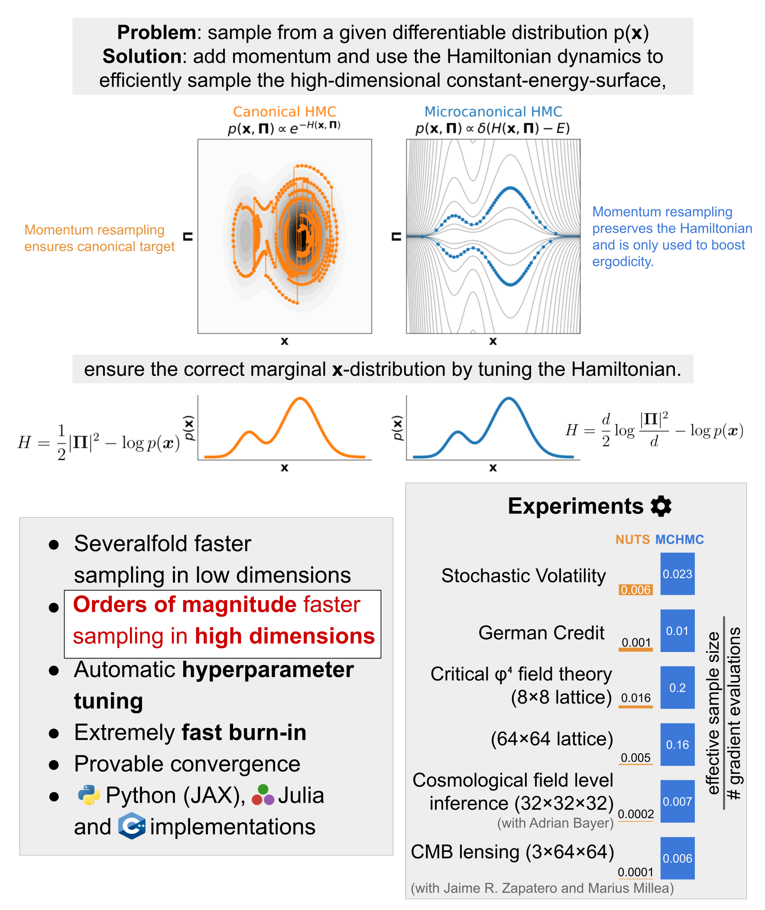

# MicroCanoncial Hamiltonian Monte Carlo (MCHMC)

## Installation 

`pip install mclmc`

## Overview

You can check out the tutorials:
- [getting started](notebooks/tutorials/intro_tutorial.ipynb): sampling from a standard Gaussian (sequential sampling)
- [advance tutorial](notebooks/tutorials/advanced_tutorial.ipynb): sampling the hierarchical Stochastic Volatility model for the S&P500 returns data (sequential sampling)

Julia implementation is available [here](https://github.com/JaimeRZP/MicroCanonicalHMC.jl).

The associated papers are:
- [method and benchmark tests](https://arxiv.org/abs/2212.08549)
- [formulation as a stochastic process and first application to the lattice field theory](https://arxiv.org/abs/2303.18221)

If you have any questions do not hesitate to contact me at jakob_robnik@berkeley.edu

